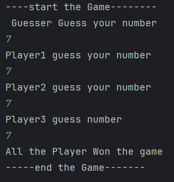
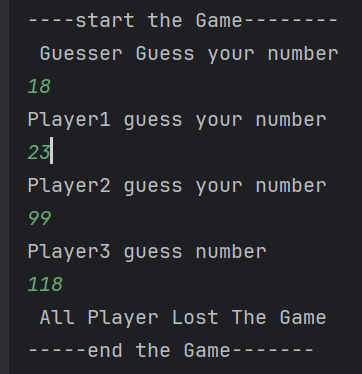

# 🎮 Guesser Game (Java)

A fun, console-based number guessing game developed in Java. The game involves a **Guesser** who picks a number, and three **Players** try to guess the same number. An **Umpire** manages the game by collecting inputs and comparing the guesses.

---

## 📌 Features

- Object-Oriented Programming using Java classes (`Guesser`, `Player`, `Umpire`)
- Input collection from multiple players
- Comparison logic to determine winners
- Multiple winning scenarios (all win)
  


- (single winner)

  


-Player Lost
 


  
- Fully interactive through console

---

## 💻 Technologies Used

- Java (OOP, Scanner for input)
- Console I/O
- No external libraries or GUI — simple and clean Java code

---

## 🚀 How to Run

1. **Clone the repository**
   ```bash
   git clone https://github.com/surendrapratapmishra51/GusserGame.git
